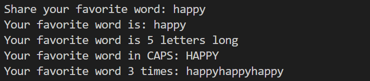

## Calculator Lab

### Types & Variables Output
I created profile data and printed strings using both concatenation and f-strings to easily plug in variables. I then used math operators to calculate future age, dog years, the area of a rectangle, and estate area. In order to keep the calculations in a readable format I implemented floating and rounding for certain variables in the printed statements.

Here is the output:

- 

### Simple Calculator
One main challenge was validating user input for the numbers. This varied from how I would handle it in JS using `parseFloat`. I didn't want to do a complex string replacement helper to clean up invalid input or handle limitations with `isdigit()` which wouldn't work for negative numbers and floats. 

I decided to go with a `regex` pattern matching method to handle negative numbers and decimals. If the match returns `None`, the error handling will tell the user to put in new numbers. Otherwise, it can safely be floated and used in calculations. This error handling would unfortunately cause the user to re-input everything from the start of the script, but this is an acceptable tradeoff for a very simple calculator.

Another challenge was figuring out how to take the operator string the user inputted and use it for arithmetic. I found a StackExchange article which proposes using a dictionary to determine an operator and be able to calculate an answer. This seemed like an efficient way to handle the operation, especially when handling invalid user inputs. I was able to have O(1) lookups by simply checking if the operator input is a key in the dictionary.

Overall, the biggest challenge was learning how to translate my JS syntax instincts into Python.

Here is successful output with floats and negatives
- 

Here is how invalid input is handled
- 

- 

### String Fun Script
This script is meant to take a favorite word input and practice with Python built-in string methods to display it in different ways for the user. Here is the output:

- 

### References
- https://mimo.org/glossary/python/float
- https://mimo.org/glossary/python/round-function
- https://stackoverflow.com/questions/1740726/turn-string-into-operator
- https://docs.python.org/3/library/operator.html
- https://www.digitalocean.com/community/tutorials/python-convert-string-to-float
- https://www.codecademy.com/article/python-exit-commands-quit-exit-sys-exit-os-exit-and-keyboard-shortcuts 
- https://betterstack.com/community/questions/python-check-if-key-exists-in-dictionary/ 

